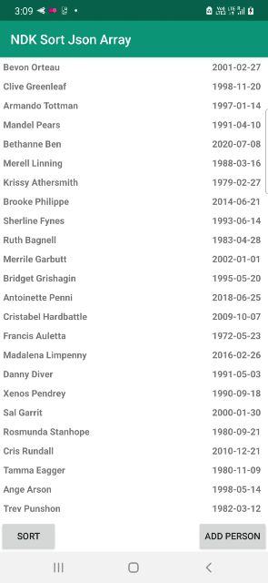
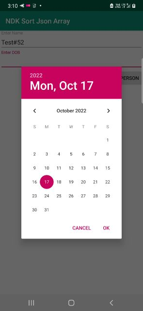
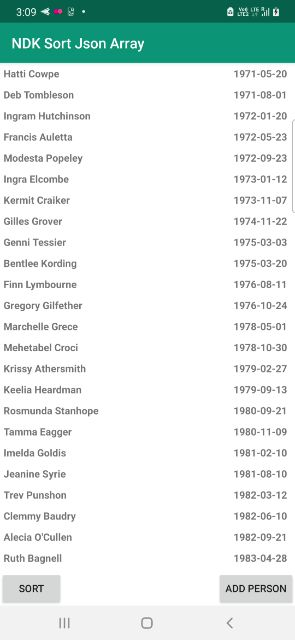

# NDK Json Array Sort

An Android app project demo showing JSON array sort,
using JNI bridge to communicate between app and native library,
written in Kotlin and C++. 

Credit:
Lohmann, N. (2022). JSON for Modern C++ (Version 3.11.2) [Computer software]. https://github.com/nlohmann

